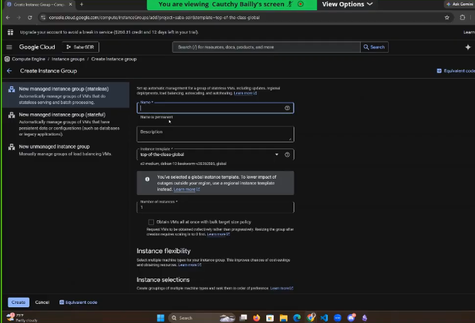
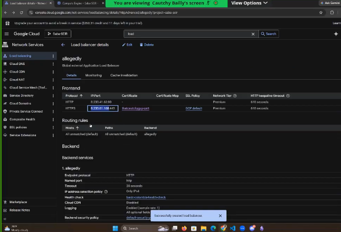
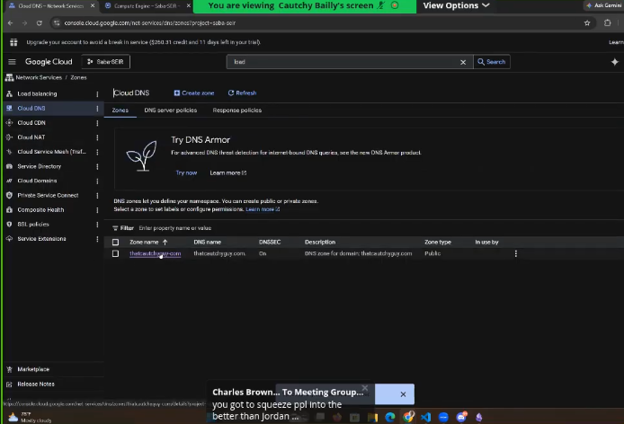
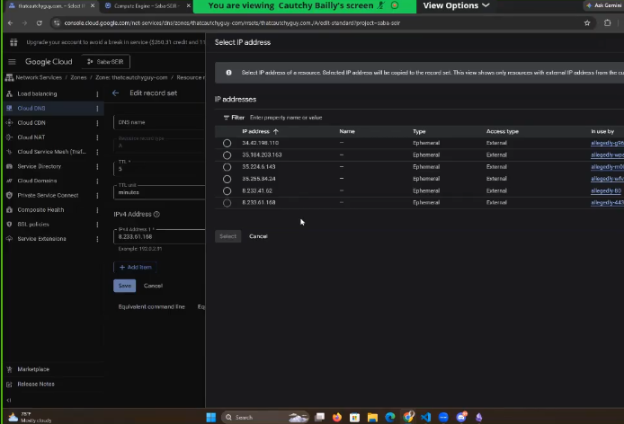

class started @38:33

## creating an instance group
1. naviage to instacnes > templates
2. select an template

3. created the instance group
4. enter a name
5. enter a description
6. number of instance 4
7. click at least 4 zones

## configure auto healing
1. select any health check

note
do not do 443 for the mig 443 is only for load balalncers
443 is for the frontend 
443 is not for the backend because we dont need the encryption
doing encryption for the backend is much more advanced
443 is only for the external to the load balancer you never have 443 to the mig
443 to the mig means you have an very tight security enviornment

## finishing mig configuration
click on create, and now we have an mig

click on the onstance group we created, and go to port mapping
add the following
1. http port 80

## creating the load balancer
1. select application load balancer
2. go with most of the defaults

## front-end configuration
1. name the front-end
2. protocol https port 443
3. select use classic certificates
4. select an certificate

Notes: i didnt create an certificate i need to go back and watch videos to figure  out how they did this

certificate was created in 05-15
@51:05

6. added an second port to the front-end
7. http port 80

## back-end configuration
creating an backend bucket
1. create an backend bucket
2. disable cloud cdn
3. click browse, and select an backend bucket
4. click create

creating an backend service
1. backend type is instance group
2. protocol is http
3. select an health check
4. modify RPS to be 10
5. enable logging
6. disable cdn
7. click create

## routring rules
1. backend is the service for backend 1
2. click create
3. now we have created the load balancer

1. copy the ip address for https

1. click on a domain that we own

2. modified the a record to be the ip address for https

class stopped @ 01:21:43