talked about general knowladge and documentation for 45 minutes 
the lab starts @45:58

1. navigated to cloud router

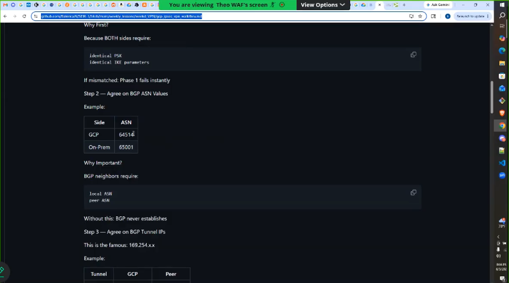
cloud router asn
you need to agree on what your asn is for your vpn to work
the vpn asn values are 64514
the range for private asn is 64512 to 65534

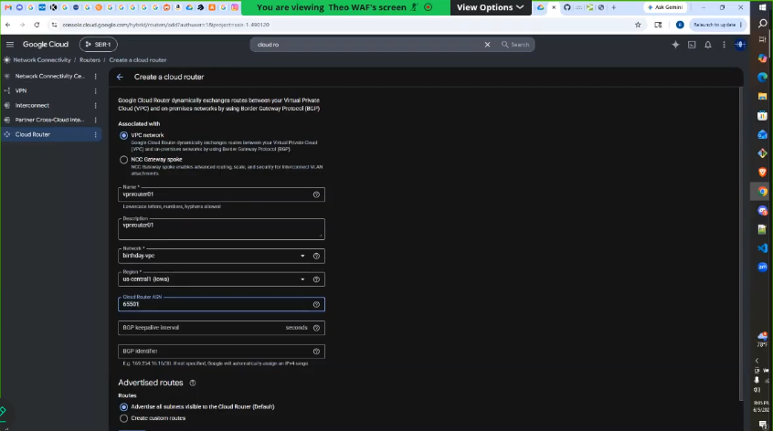
this is the configuration
cloud router asn is 65501

in a separate node pad keep an record of the configuration
1. record the ASN of your asn and the customers

gbp interval is 20
bgp identifier is

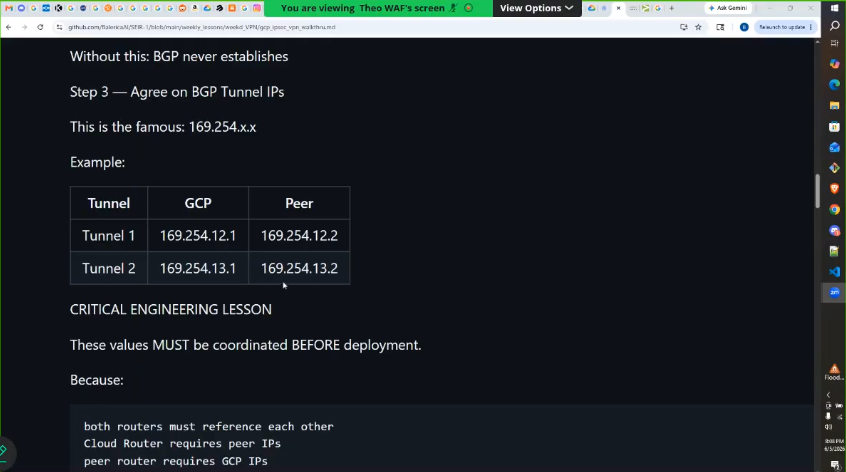
interview gotcha
@50:31
169.254.13.1 has been reserved for gbp internal networks over an vpn
you need to identify that the network is gonna be and share it with the other person
the information in the screenshot above needs to be defined before you start

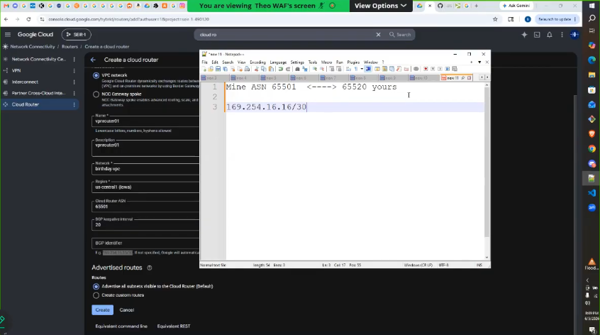
took the value from the console
the /30 means it looking for an specific network value
changed the value in our notebad to 169.254.5.0/30
169.254.5.0/30 will be the bgp identifier
click create

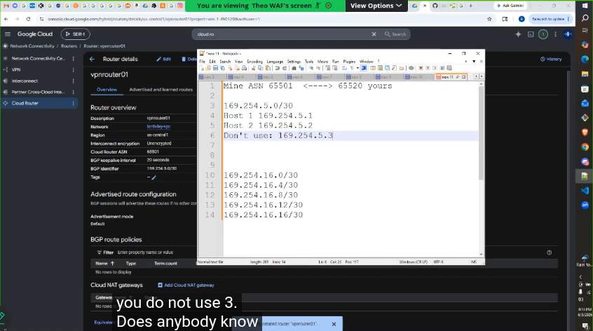
notes about hosts
you do not use 0 because it is an network identifier
you do not use 3 because it is reserved for broadcast

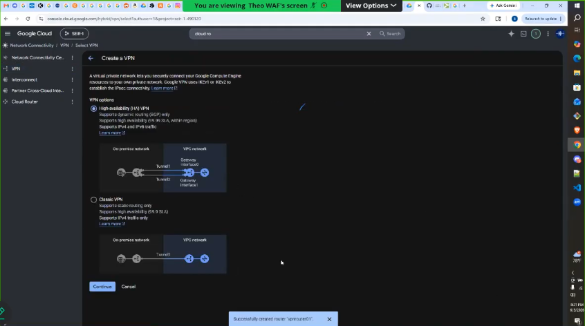
creating the VPN
selected HA VPN

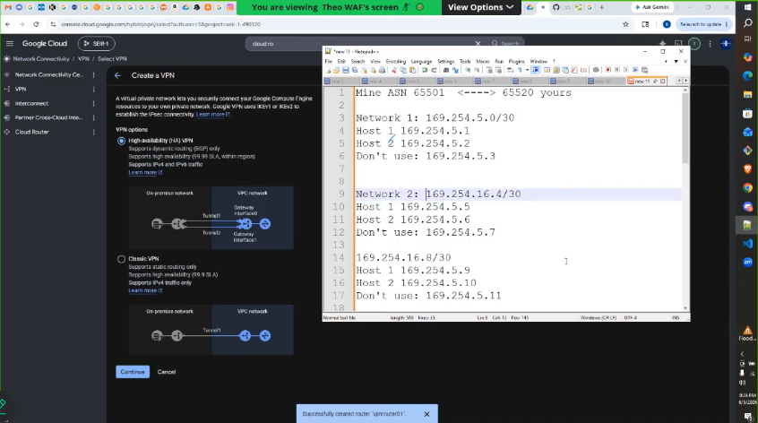
the ip address scheme

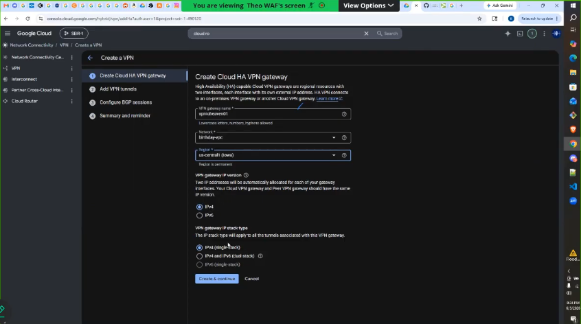
this is the configuration for the Cloud HA VPN Gateway

vpn tunnel configuration
- on prem or non google cloud

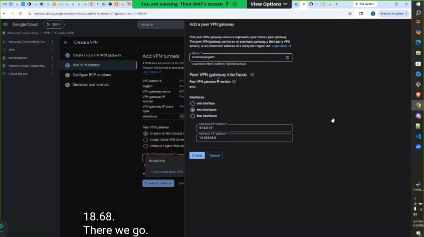
added a peer VPN gateway
these are the configuration settings
click create
we have create an remote vpn gateway for the other side but this is just an value
the remote vpn gateway does not exist at this movement
at this momement it is a placeholder

routing options
1. cloud router: select the router we already created

vpn tunnel 1
1. name: vpnremoteinterface01

ike pre-shared key
you have to have this pre-shared key
1. click generate to generate the key

paste the preshared key in your notes

vpn tunnel 2
1. name: vpnremoteinterface02

ike pre-shared key
you have to have this pre-shared key
1. click generate to generate the key

paste the preshared key in your notes

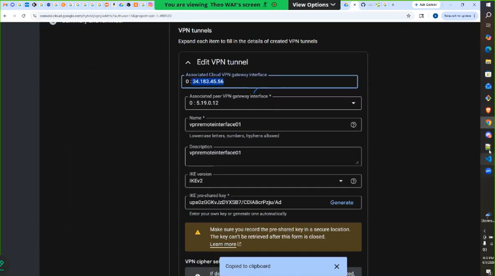
copied the gateway interface value, and paste it into your notes
and record the ip of the second gateway interface
theese are public ip addresses, and they need to bbe shared with the other person ( we are copying the cloud vpn gateway interface not the associated peer interace)

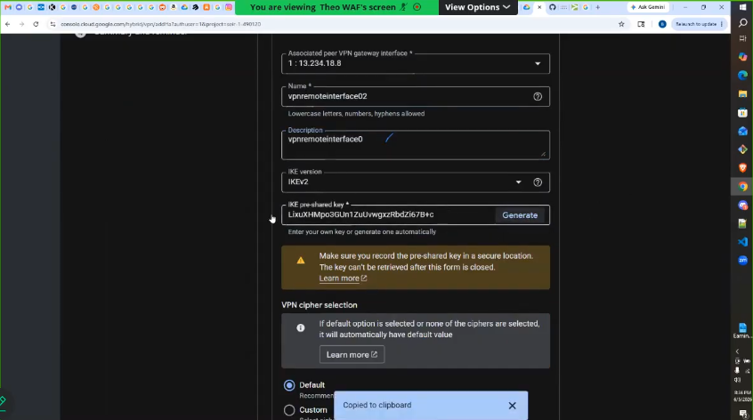
this is the configuration for the second interface
paste in the psk in you docs
click create

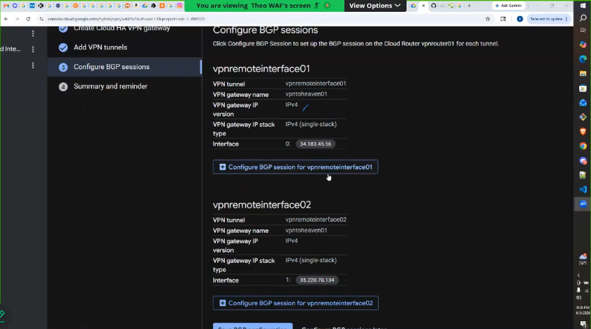
configuring bgp sessions for interface 1 
1. name it gbpnetwork01
2. paste in peer asn from notes
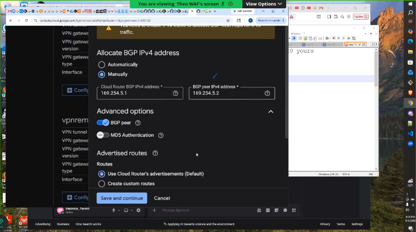
3. allocate bgp ipv4 addresses manually ( host ip addresses)
4. save and continue

configuring bgp sessions for interface 2 
1. name it gbpnetwork02
2. paste in peer asn from notes
3. allocate bgp ipv4 addresses manually ( host ip addresses)
4. save and continue

finish configuration
1. save bgp configuration

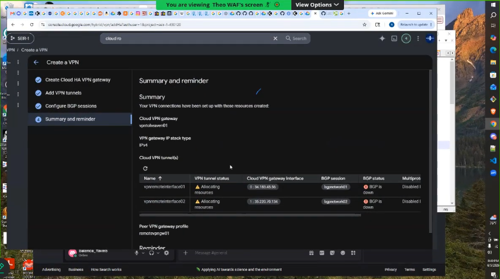
bgp is down because the other send/ second person isnt set up

### setting up the other end

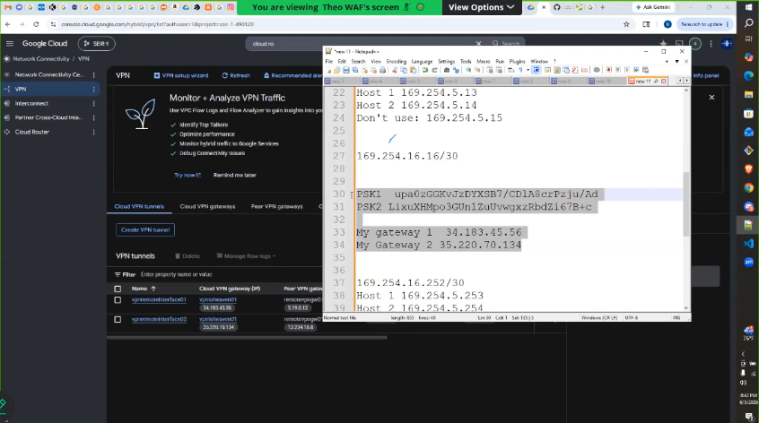
this is the information the other person needs to make bthe connection

@1:30:00
couldnt connect thwe other vpn because it is in google cloud

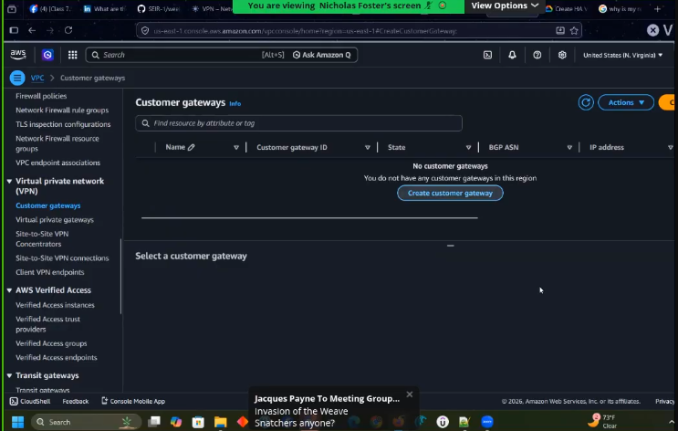
@2:08:00 we are in aws
created first customer gateway
1. asn 65001
2. ip address 34.183.45.56
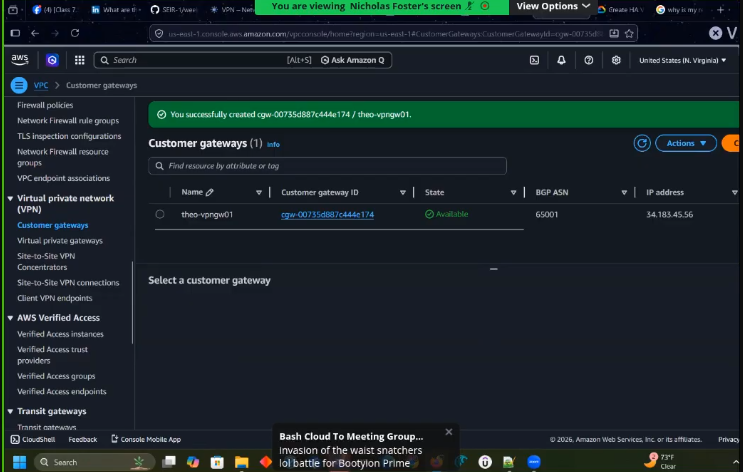
3. click create

@2:08:00 we are in aws
created second customer gateway
1. asn 65001
2. ip address 35.220.70.134
3. click create

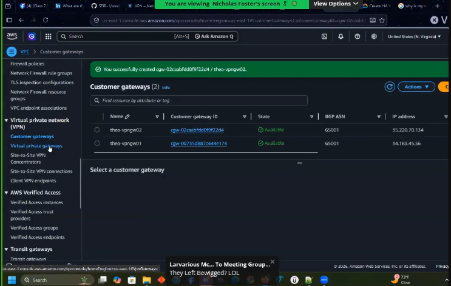
now we have two customer gateways

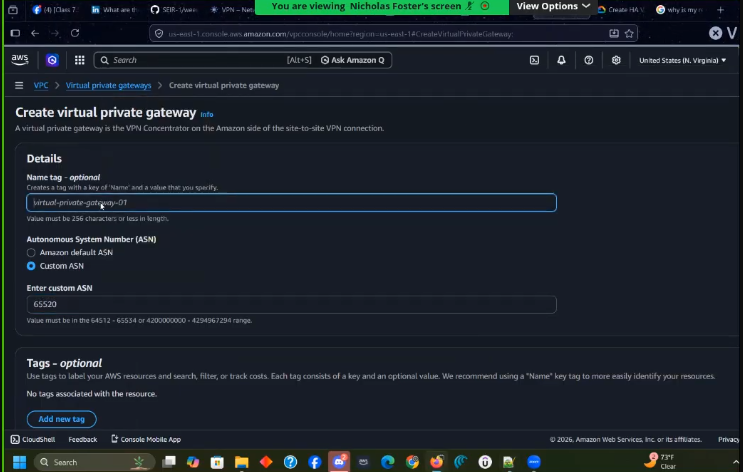
create fist virtual private gateway

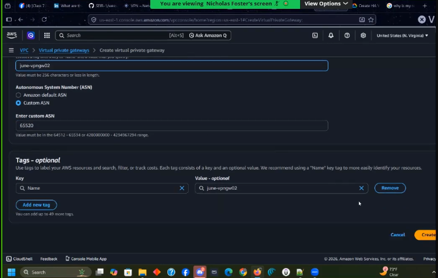
create second virtual private gateway

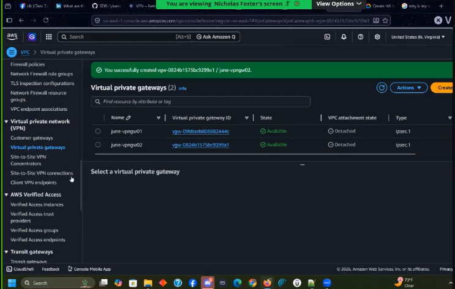
now we have two virtual private gateways

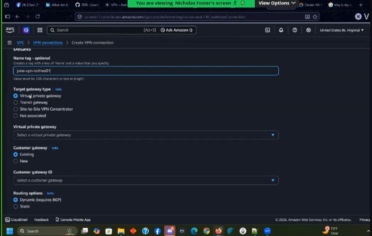
creating vpn connection

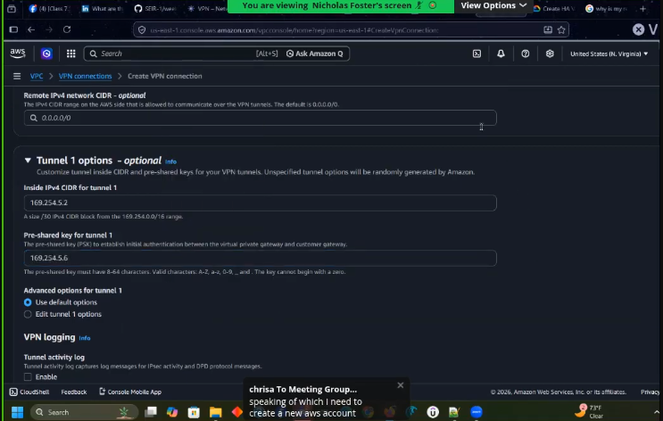
tunnel 1 creation

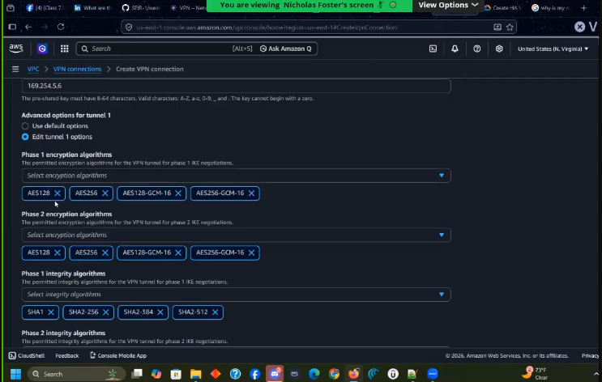
these are all the options you have to create the vpn ipsec tunnel

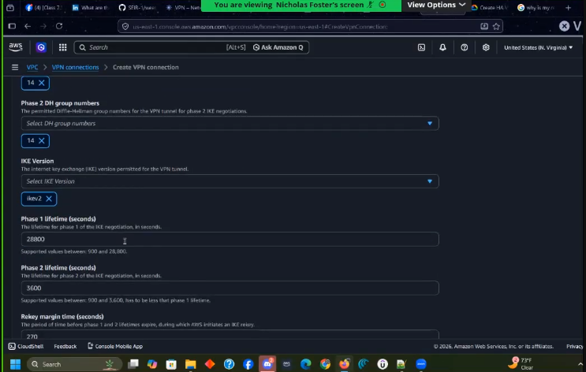
you only need 14

enable tunnel activity log
select an cloudwatch group
enable tunnel bgp log

do the same thing for tunnel 2

stopped @2:23:20
configuration wasnt finished theo mentioning finishing the config next friday