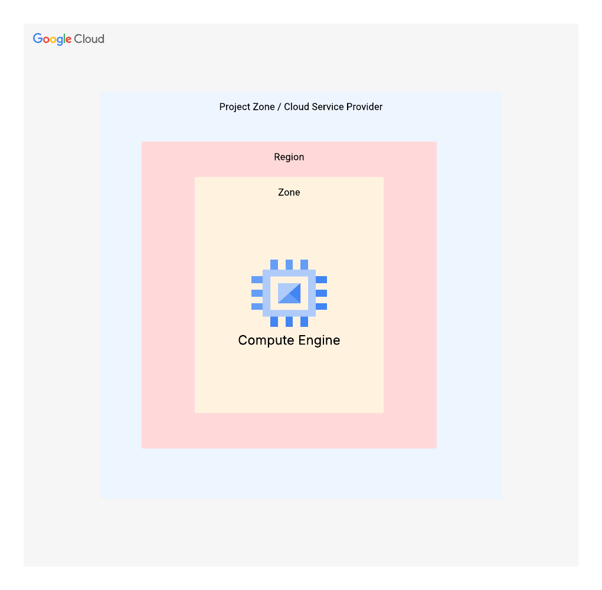

# VM Instance Deployment Project Documentation

---

## 1. Project Overview : VM Instance Deployment
Deploy a VM instance with supera.sh script and check the success of your deployment with the “gate” script given

---

## 2. Technical Architecture
*The "blueprint" of the solution.*

* **Architecture Diagram:** 
* **Resource Inventory:** (VMs).
* **Decision Log:** Why did you choose Service Accounts over User Accounts? Why this specific CIDR?

---

## 3. Deployment Instructions
*Can another engineer (or your future self) recreate this in 5 minutes?*

* **Prerequisites:** [e.g., Enable Compute Engine API, Install gcloud SDK].
* **Execution:**
    * **Option A (CLI):** Provide `gcloud` code blocks.
    * **Option B (IaC):** Provide links to `.tf` (Terraform) files in the directory.
    * **Option C (Console):** Provide `console` instructions

Navigate to VPC network > VPC networks and click Create VPC Network

1. Enter a Name for the VPC. In this case its called custom-vpc-demo
2. Choose Automatic for subnet creation mode
3. Navigate to Subnets and create  subnets <br>
   Creation of the first subnet <br>
      &nbsp; A. Enter a Name for the subnet. In this case its called us-central1 <br>
      &nbsp; B. Enter a Region for the subnet. <br>
      &nbsp; C. Enter a IP range for the subnet. In this case it is 168.192.0.0/24 <br>
      &nbsp; D. click on done <br>
   
4. Finishing VPC Configuration
   A. Clicked on create

Navigate to VPC network > Firewall and click Create Firewall Rule

1. Created firewall rule for ssh, icmp, tcp
2. Clicked on create firewall rule
3. Enter a Name for the Firewall rule and Called it custom-vpc-demo-ssh
4. For network selected custom vpc network
5. For Target select `specified target tags`
6. For Target tags enter custom-demo-network
7. For Source IP ranges enter 0.0.0.0/0
8. For ports and protocols <br>
   &nbsp; A.  Checked TCP, and for Ports entered 22,3369 <br>
   &nbsp; B.  Checked Other, and typed ICMP <br>
9. Clicked on create

Navigate to Compute Engine > VM instances and click Create instance

1. Enter a Name for the instance and called it my-custom-1
2. Enter a Region for the instance, and pick a zone.
3. Navigate to Networking tab > Firewall <br>
   &nbsp; A. Check Allow HTTP Traffic <br>
   &nbsp; B. Check Allow HTTPS Traffic <br>
4. Navigate to Advanced tab > Automation <br>
   &nbsp; A. Pasted in a script in automation script

```
#!/bin/bash
set -euo pipefail

#Chewbacca: The node awakens. And it will speak in HTML, plain text, and JSON.

#Thanks for Aaron!
sleep 5
apt update -y
apt install -y nginx curl jq

METADATA="http://metadata.google.internal/computeMetadata/v1"
HDR="Metadata-Flavor: Google"
md() { curl -fsS -H "$HDR" "${METADATA}/$1" || echo "unknown"; }

INSTANCE_NAME="$(md instance/name)"
HOSTNAME="$(hostname)"
PROJECT_ID="$(md project/project-id)"
ZONE_FULL="$(md instance/zone)"                  # projects/<id>/zones/us-central1-a
ZONE="${ZONE_FULL##*/}"
REGION="${ZONE%-*}"
MACHINE_TYPE_FULL="$(md instance/machine-type)"
MACHINE_TYPE="${MACHINE_TYPE_FULL##*/}"

INTERNAL_IP="$(md instance/network-interfaces/0/ip)"
EXTERNAL_IP="$(md instance/network-interfaces/0/access-configs/0/external-ip)"
VPC_FULL="$(md instance/network-interfaces/0/network)"
SUBNET_FULL="$(md instance/network-interfaces/0/subnetwork)"
VPC="${VPC_FULL##*/}"
SUBNET="${SUBNET_FULL##*/}"

START_TIME_UTC="$(date -u +"%Y-%m-%dT%H:%M:%SZ")"

# --- Student banner ---
# Students set this when creating the VM by adding a metadata key:
#   student_name = Darth Malgus Jr
STUDENT_NAME="$(md instance/attributes/student_name)"
[[ -z "$STUDENT_NAME" || "$STUDENT_NAME" == "unknown" ]] && STUDENT_NAME="Anonymous Padawan (temporarily)"

# --- Basic system stats ---
UPTIME="$(uptime -p || true)"
LOADAVG="$(awk '{print $1" "$2" "$3}' /proc/loadavg 2>/dev/null || echo "unknown")"

MEM_TOTAL_MB="$(free -m | awk '/Mem:/ {print $2}')"
MEM_USED_MB="$(free -m | awk '/Mem:/ {print $3}')"
MEM_FREE_MB="$(free -m | awk '/Mem:/ {print $4}')"

DISK_LINE="$(df -h / | tail -n 1)"
DISK_SIZE="$(echo "$DISK_LINE" | awk '{print $2}')"
DISK_USED="$(echo "$DISK_LINE" | awk '{print $3}')"
DISK_AVAIL="$(echo "$DISK_LINE" | awk '{print $4}')"
DISK_USEP="$(echo "$DISK_LINE" | awk '{print $5}')"

# --- Nginx config: add endpoints /healthz and /metadata ---
cat > /etc/nginx/sites-available/default <<'EOF'
server {
    listen 80 default_server;
    listen [::]:80 default_server;

    root /var/www/html;
    index index.html;

    #Chewbacca: The homepage is for humans.
    location = / {
        try_files /index.html =404;
    }

    #Chewbacca: Health checks are for machines. Keep it boring.
    location = /healthz {
        default_type text/plain;
        return 200 "ok\n";
    }

    #Chewbacca: Metadata is for engineers and scripts.
    location = /metadata {
        default_type application/json;
        try_files /metadata.json =404;
    }
}
EOF

# --- Write JSON endpoint file ---
cat > /var/www/html/metadata.json <<EOF
{
  "service": "seir-i-node",
  "student_name": "$(echo "$STUDENT_NAME" | sed 's/"/\\"/g')",
  "project_id": "$PROJECT_ID",
  "instance_name": "$INSTANCE_NAME",
  "hostname": "$HOSTNAME",
  "region": "$REGION",
  "zone": "$ZONE",
  "machine_type": "$MACHINE_TYPE",
  "network": {
    "vpc": "$VPC",
    "subnet": "$SUBNET",
    "internal_ip": "$INTERNAL_IP",
    "external_ip": "$EXTERNAL_IP"
  },
  "health": {
    "uptime": "$UPTIME",
    "load_avg": "$LOADAVG",
    "ram_mb": {"used": $MEM_USED_MB, "free": $MEM_FREE_MB, "total": $MEM_TOTAL_MB},
    "disk_root": {"size": "$DISK_SIZE", "used": "$DISK_USED", "avail": "$DISK_AVAIL", "use_pct": "$DISK_USEP"}
  },
  "startup_utc": "$START_TIME_UTC"
}
EOF

# --- Write the main HTML dashboard ---
cat > /var/www/html/index.html <<EOF
<!DOCTYPE html>
<html>
<head>
  <meta charset="utf-8"/>
  <title>SEIR-I Ops Panel</title>
  <meta http-equiv="refresh" content="10">
  <style>
    body { background:#0b0c10; color:#c5c6c7; font-family: ui-monospace, SFMono-Regular, Menlo, Monaco, Consolas, "Liberation Mono", monospace; }
    .wrap { max-width: 950px; margin: 40px auto; padding: 24px; }
    h1 { color:#66fcf1; margin:0 0 8px 0; }
    .sub { color:#45a29e; margin-bottom: 18px; }
    .banner { border:1px solid #66fcf1; border-radius: 10px; padding: 10px 14px; margin-bottom: 14px; background: rgba(102,252,241,0.06); }
    .grid { display:grid; grid-template-columns: 1fr 1fr; gap: 14px; }
    .card { border:1px solid #45a29e; border-radius: 10px; padding: 14px 16px; background: rgba(255,255,255,0.03); }
    .k { color:#66fcf1; }
    .v { color:#ffffff; }
    .footer { margin-top: 18px; color:#45a29e; font-size: 12px; }
    a { color:#66fcf1; text-decoration:none; }
    a:hover { text-decoration:underline; }
  </style>
</head>
<body>
  <div class="wrap">
    <h1>⚡ SEIR-I Ops Panel — Node Online ⚡</h1>
    <div class="sub">This is your proof-of-life: VM + startup automation + HTTP service.</div>

    <div class="banner">
      <span class="k">Deploy Banner:</span>
      <span class="v">${STUDENT_NAME}</span>
      <span class="k"> | Startup UTC:</span>
      <span class="v">${START_TIME_UTC}</span>
      <span class="k"> | Auto-refresh:</span>
      <span class="v">10s</span>
    </div>

    <div class="grid">
      <div class="card">
        <div class="k">Identity</div>
        <div><span class="k">Project:</span> <span class="v">${PROJECT_ID}</span></div>
        <div><span class="k">Instance:</span> <span class="v">${INSTANCE_NAME}</span></div>
        <div><span class="k">Hostname:</span> <span class="v">${HOSTNAME}</span></div>
        <div><span class="k">Machine:</span> <span class="v">${MACHINE_TYPE}</span></div>
      </div>

      <div class="card">
        <div class="k">Location</div>
        <div><span class="k">Region:</span> <span class="v">${REGION}</span></div>
        <div><span class="k">Zone:</span> <span class="v">${ZONE}</span></div>
        <div><span class="k">Uptime:</span> <span class="v">${UPTIME}</span></div>
        <div><span class="k">Load Avg:</span> <span class="v">${LOADAVG}</span></div>
      </div>

      <div class="card">
        <div class="k">Network</div>
        <div><span class="k">VPC:</span> <span class="v">${VPC}</span></div>
        <div><span class="k">Subnet:</span> <span class="v">${SUBNET}</span></div>
        <div><span class="k">Internal IP:</span> <span class="v">${INTERNAL_IP}</span></div>
        <div><span class="k">External IP:</span> <span class="v">${EXTERNAL_IP}</span></div>
      </div>

      <div class="card">
        <div class="k">System</div>
        <div><span class="k">RAM:</span> <span class="v">${MEM_USED_MB} used / ${MEM_FREE_MB} free / ${MEM_TOTAL_MB} total (MB)</span></div>
        <div><span class="k">Disk (/):</span> <span class="v">${DISK_USED} used / ${DISK_AVAIL} avail / ${DISK_SIZE} total (${DISK_USEP})</span></div>
        <div class="k" style="margin-top:10px;">Endpoints</div>
        <div><a href="/healthz">/healthz</a> (plain text)</div>
        <div><a href="/metadata">/metadata</a> (JSON)</div>
      </div>
    </div>

    <div class="footer">
      #Chewbacca: Humans celebrate the dashboard. Machines trust /healthz. Engineers curl /metadata.
    </div>
  </div>
</body>
</html>
EOF

systemctl enable nginx >/dev/null 2>&1 || true
systemctl restart nginx

#Chewbacca: Proof in terminal too.
echo "OK: SEIR-I node deployed."
echo "Try:"
echo "  curl -s localhost/healthz"
echo "  curl -s localhost/metadata | jq ."

```

5. Clicked on create

* **Configuration Quirks:** [Any "gotchas," like waiting 5 minutes for a Global Load Balancer to propagate].

---

## 4. Verification & Quality Assurance (The "Proof")
*Don't just say it works. Show it.*

* **Test Case 1:** Verified that Apache processes is running
  1. Navigate to Compute Engine > VM instances > VM instance and click on ssh
  2. Once ssh into default machine and enter the following command ` ps -ef | grep 'apache2' `.
  3. What this does is Check if Apache processes are running 

* **Test Case 2:** Pasted the IP of the instance to the browser
   1. Navigate to Compute Engine > VM instances > VM instance and copy on External IP
   2. Pasted the IP address in the URL, also type http:// before pasting in ip address
   
* **Troubleshooting Test Case 2** <br>
   If you get this error ERR_CONNECTION_REFUSED <br>
   Enter the following command <br>
   ``sudo systemctl status apache2`` <br>
   If result is this Apache failed to install or crashed
   
   Enter the following command <br>
   ``sudo apt-get update && sudo apt-get install -y apache2`` <br>
   ``sudo systemctl start apache2`` 

**Result:** 
  

* **Test Case 4:** [Describe security test, e.g., "Attempted unauthorized access"] -> **Result:** [Blocked].
* **Logs/Evidence:** Markdown blockquote of a successful command output or a screenshot.


---

## 5. Engineering Reflections 
*This shows you have a "Senior Engineer" mindset.*

* **What went wrong?** [Be honest. Troubleshooting is a skill].
* **Future Improvements:** [e.g., "Next time, I would automate the firewall rules using a CI/CD pipeline"].
* **Certification Alignment:** [Which exam objective did this satisfy? PCA, PCSE, etc.]

---

