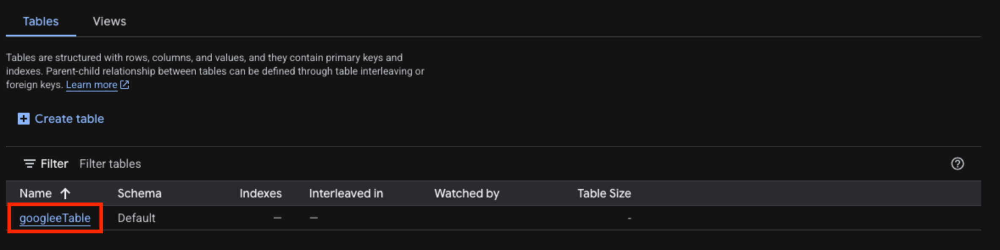

# Creating Cloud Spanner

Creating an Cloud Spanner Instance
1. Navigate to DATABASES > Spanner
1. Choose to create an instance
1. enter an instance name
1. enter an instance ID
1. select an configuration

Creating an Database
1. Navigate to overview 
1. select create database
1. enter an database name
1. In the DDL Template area create an SQL query to create an table within the database
```
CREATE TABLE googleeTable (
    EmployeeID INT64,
    Name STRING(50),
    Age INT64,
) PRIMARY KEY (EmployeeID)
```
1. Click create

Inserting values
1. click on the database created


1. navigate to data
1. click insert
1. fill out values
1. click run