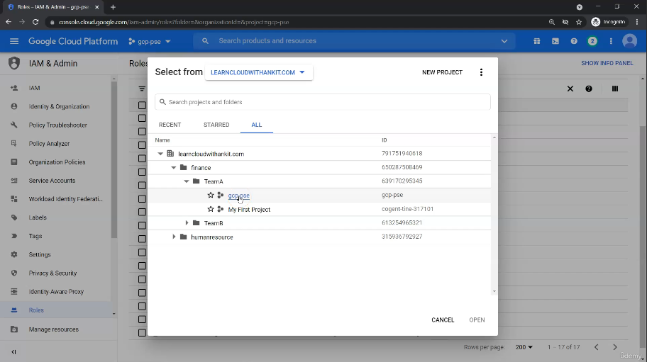
we are assiging permissions at the project level

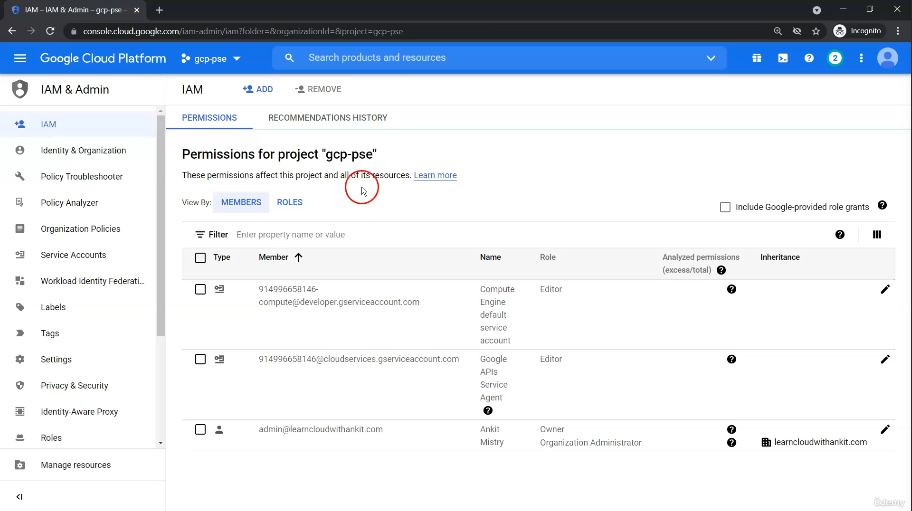
providing roles to an particular user
this screen shows an binding between users and our roles
we have a few members
we have 3 members with assigned roles

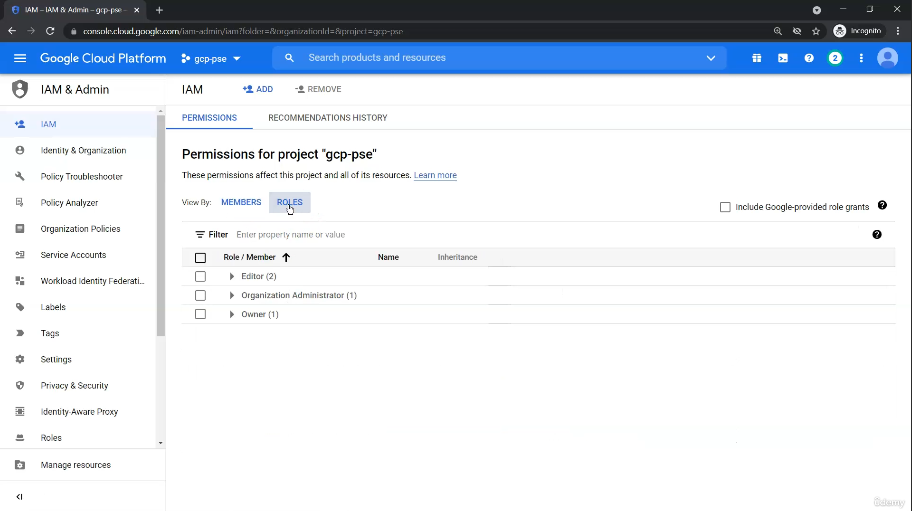
on this screen we have a few roles
this screen only shows roles that are already assigned

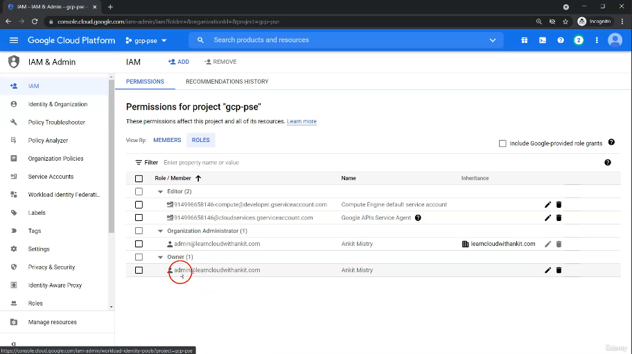
on this screen we see who were assigned what roles

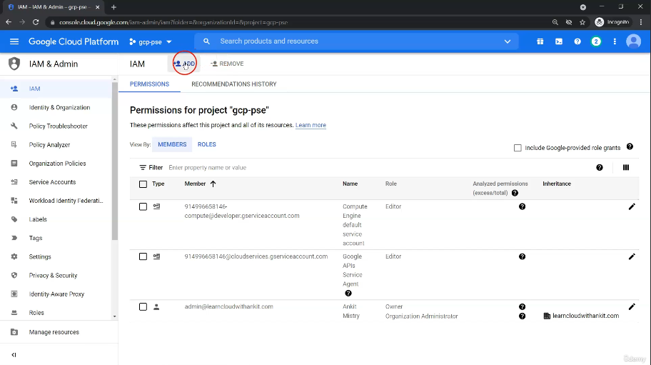
to assign an role we click on add

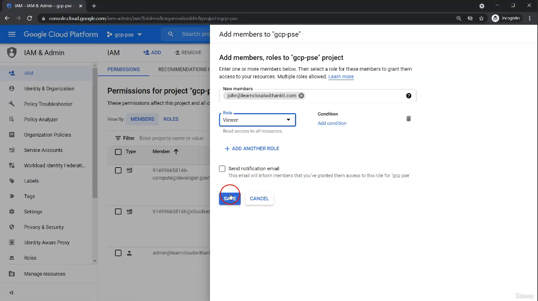
we assign an member `john`
we assign an basic viewer role

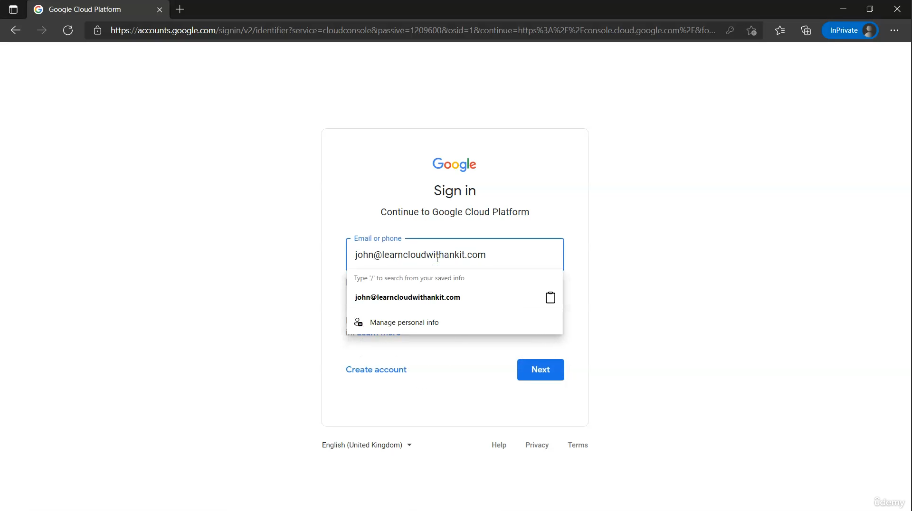
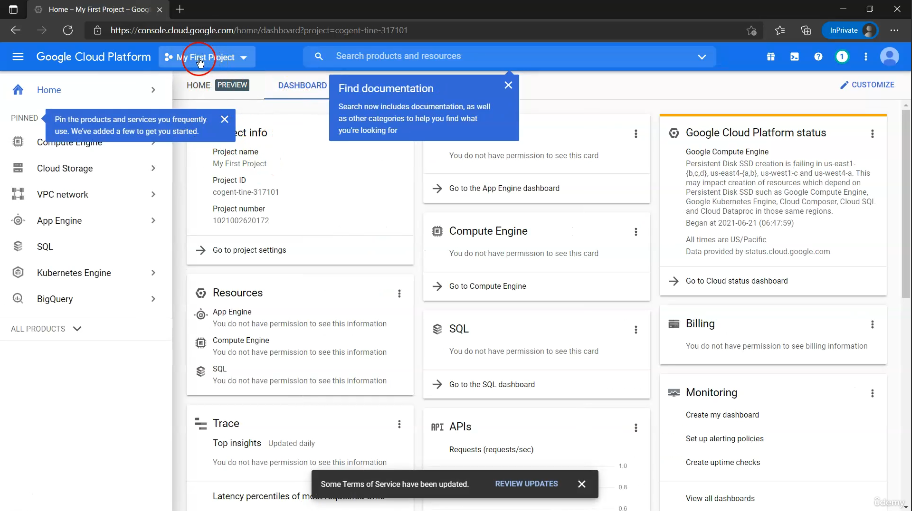
we are logging into the cloud console with users john google account. john is an user within the organization
this means john is another user who can sign into google cloud console

when john signs in we only has viewer access

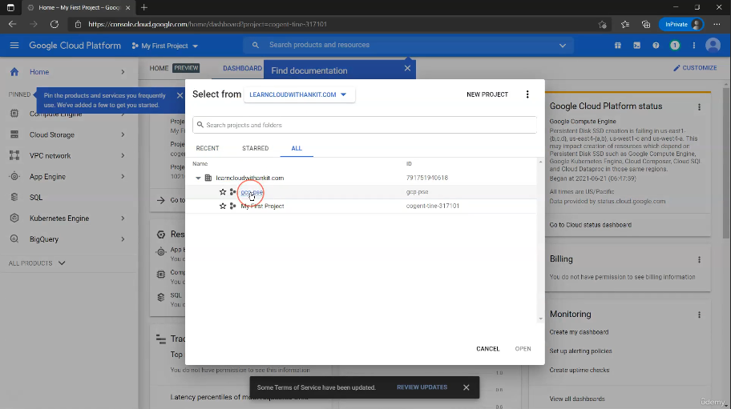
selected the project

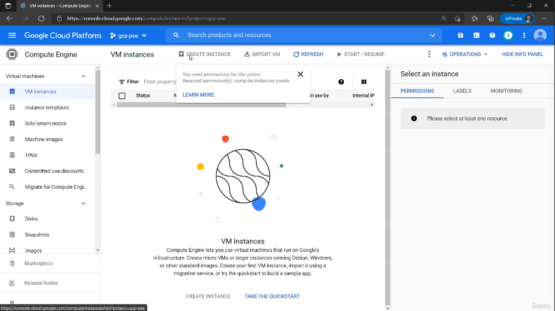
navigated to compute engine
we tried to create an instance but it has been disabled
this shows how we only have read access

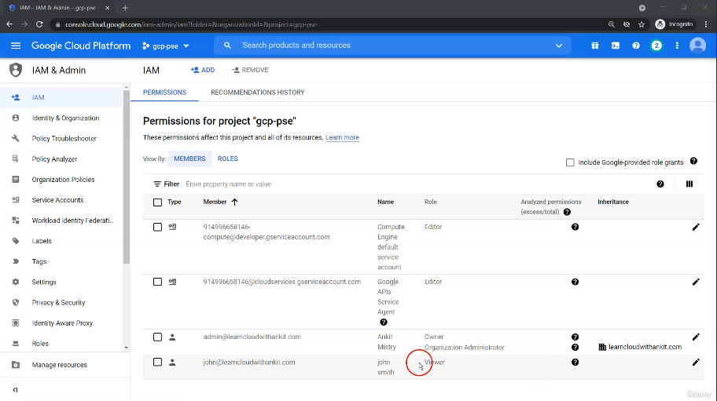
back to the main console we will assign one more role to user john

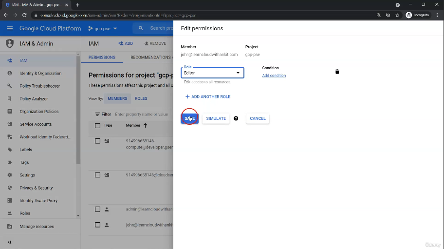
assigned an editor role to john

now john can create an instance
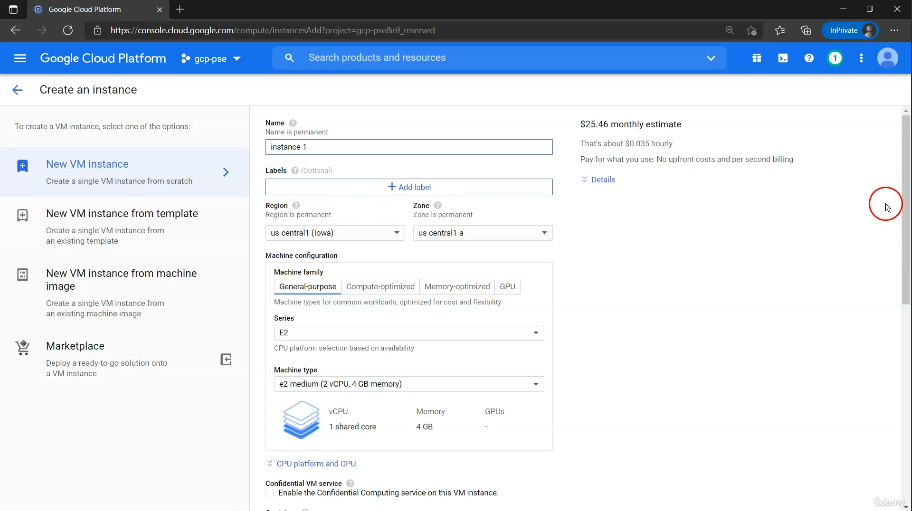