continues from the last video

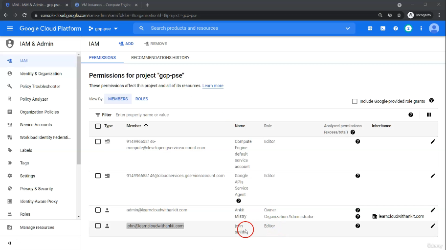
we have already assigned from primitive roles to user john who is an user within the organization
we will explore roles to specific services

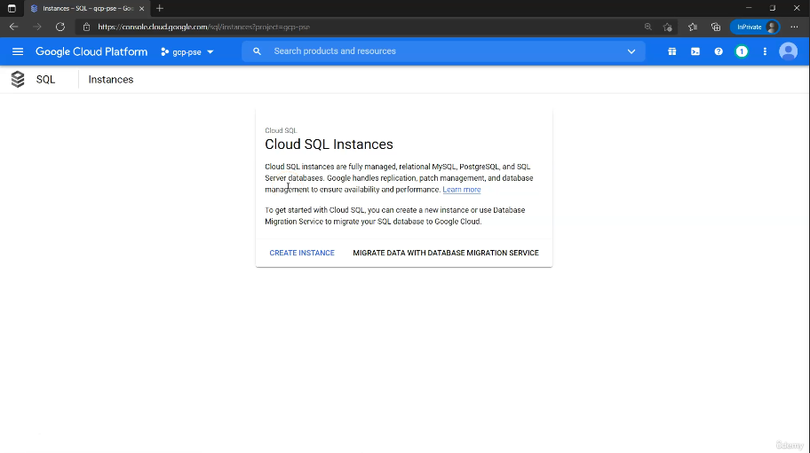
the editor role assigned was broad so we have full access to everything
we can create an Cloud SQL instance

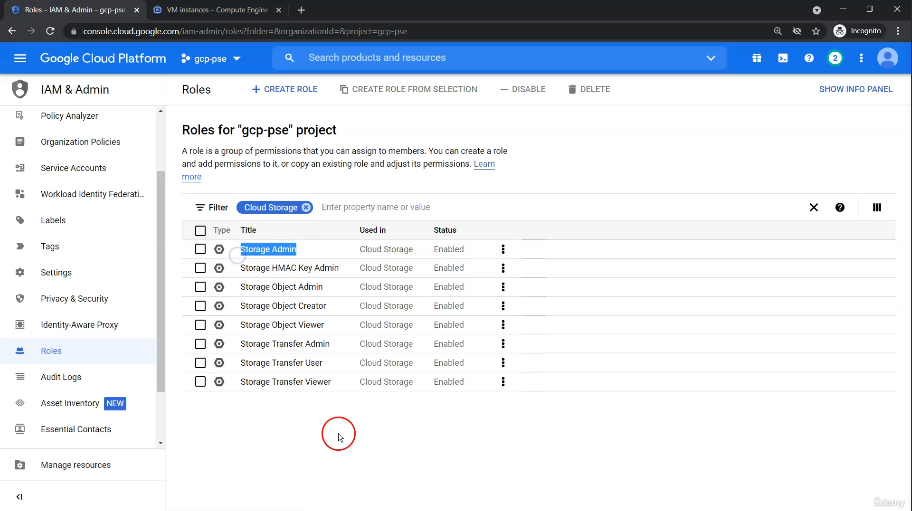
we limit access so we can only create/interact with cloud storge
with storage admin john will have complete access to cloud storage but cannot interact with any other storage services

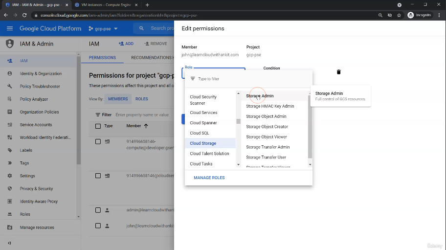
replace the editor role with cloud storage admin

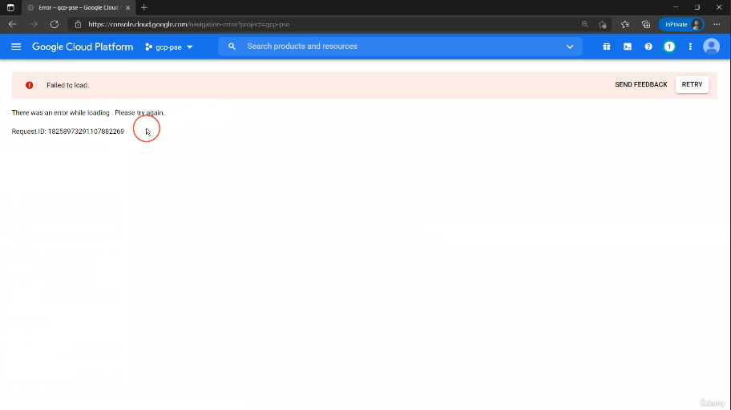
went to john
when attempting to access compute engine we got an error
which tells us the permissions are working
we should only have access to cloud storage

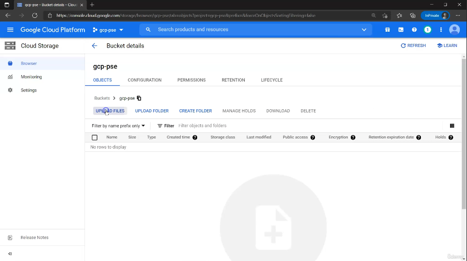
created an bucket which tells us the permissions are working

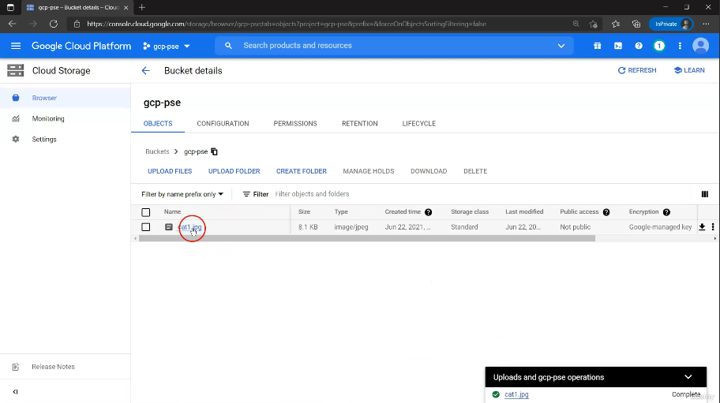
and we uploaded an image to the bucket

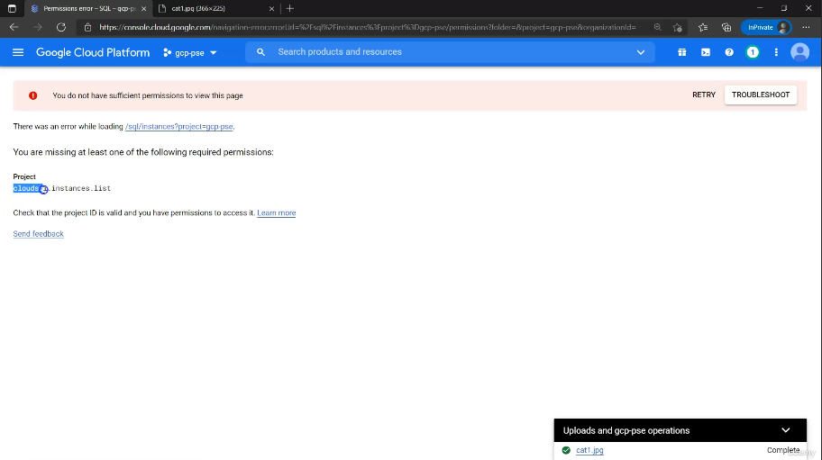
if we go to cloud sql wee dont have access
we can use the missing permission and add it

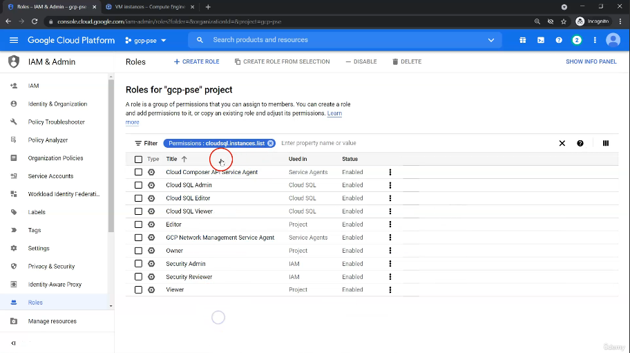
we searched for the role that contained the missing permission
in this view we have multiple

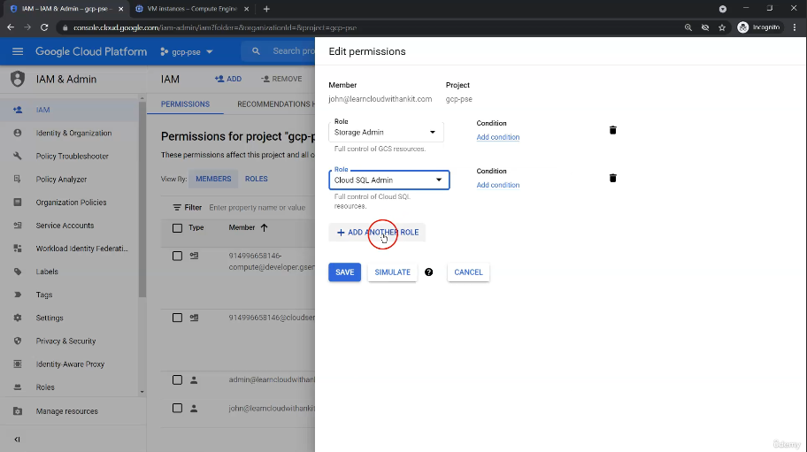
from the last screen we assigned the cloud sql admin role to john and this fixes the issue because it contains the permission

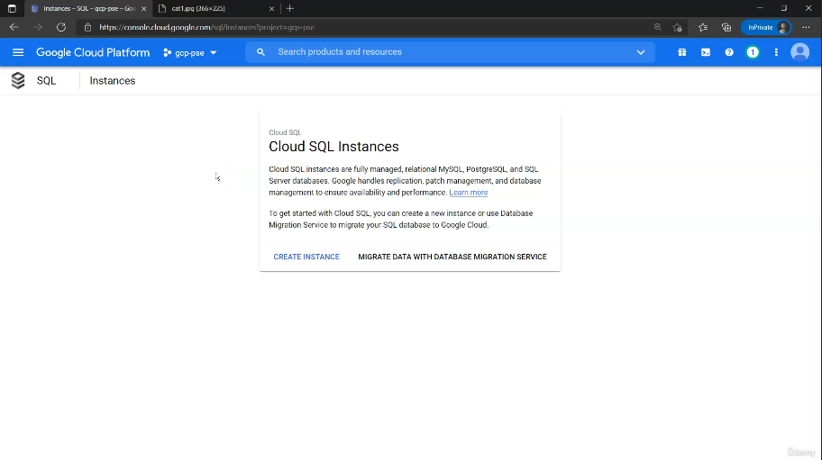
now the policy works because the error is gone
it takes some time for the policy to take effect

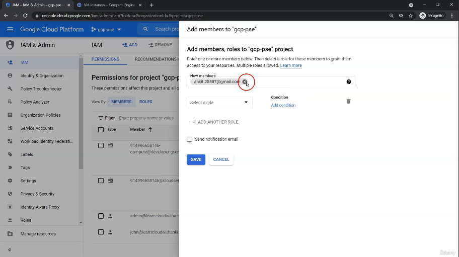
we can also add members to users who exist outside of the organization