we cant to give access to our service account via some private keys. we are gonna create some keys, give it to an person, and  they will have complete full access to our service account

what are keys
an way to access service accounts 
are like passwords
keys can be used for authentication
keys can be generated from ther cloud console

this command is used to activate the service account via an particular key

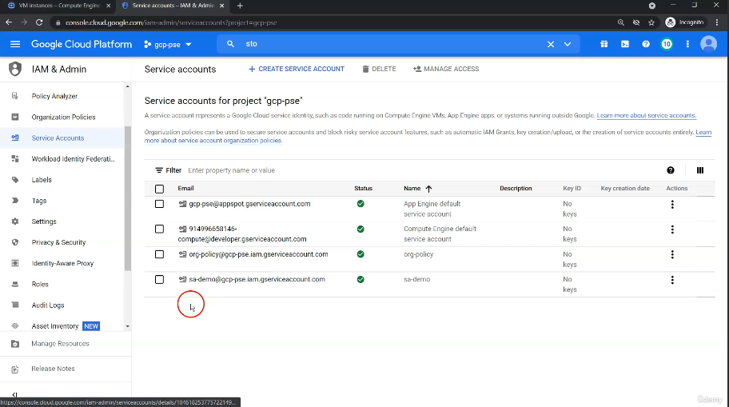
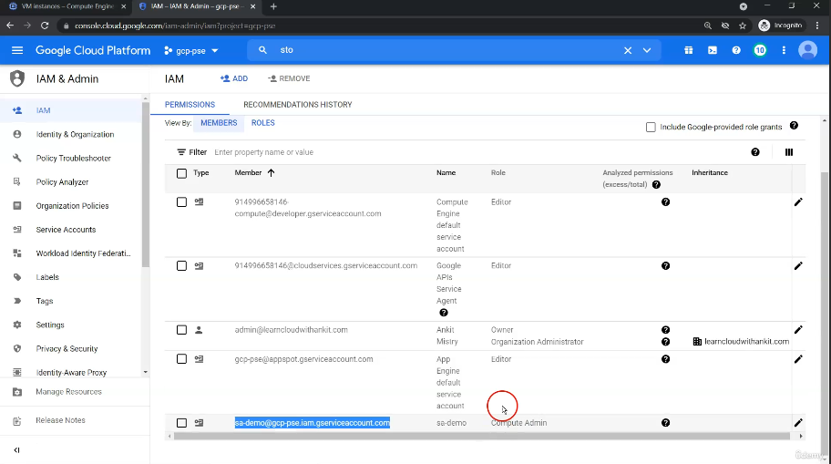
in the cloud console we have one service account, and the service account has access to the compute admin role

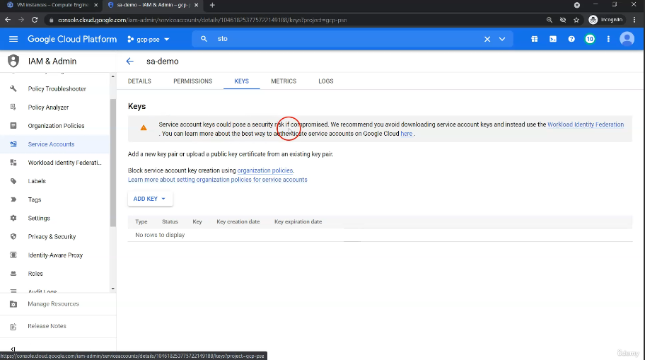
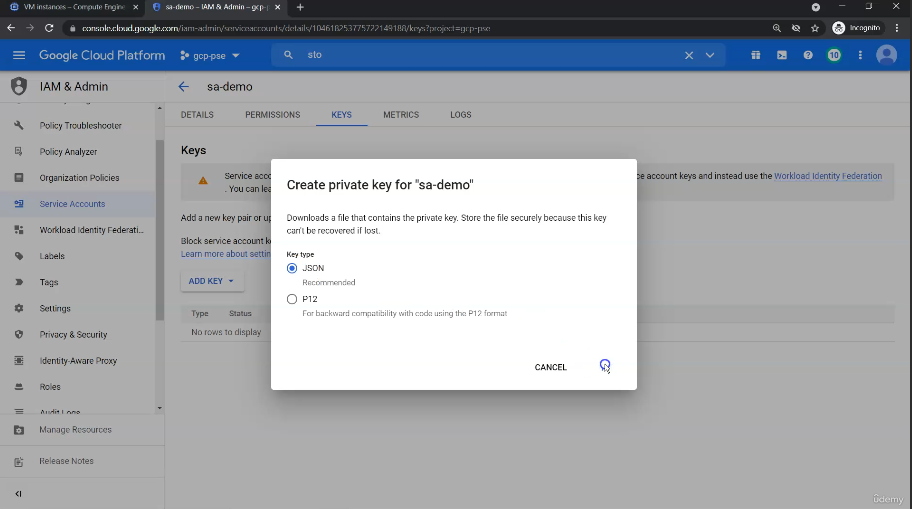
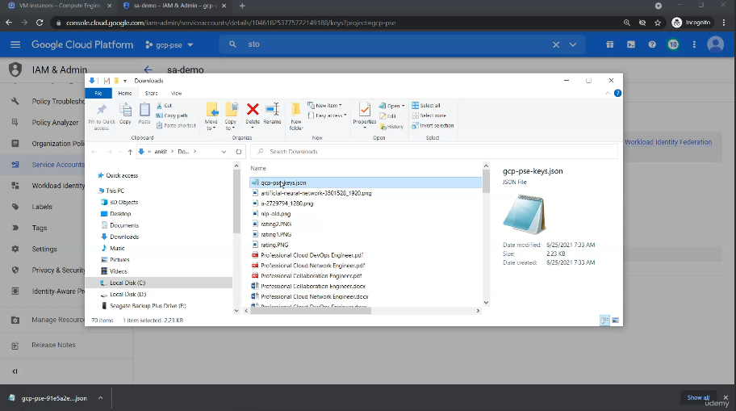
we are generating the keys for the service account
we downloaded the keys
we renamed the keys

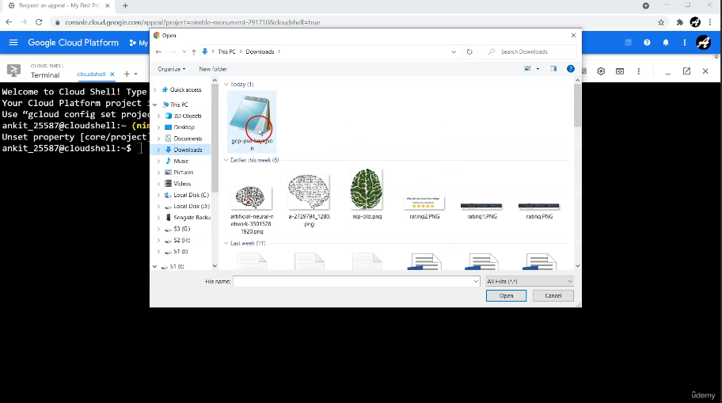
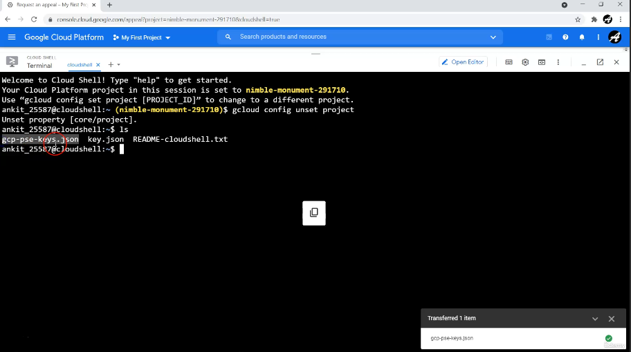
in an different account we upload the keys

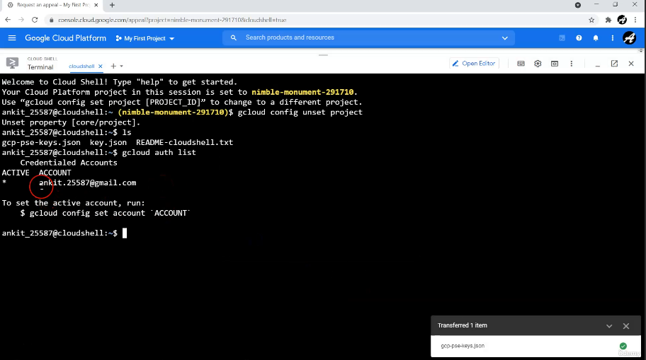
we confirm that we are using an different account from admin
this account does not have access to the project in admin

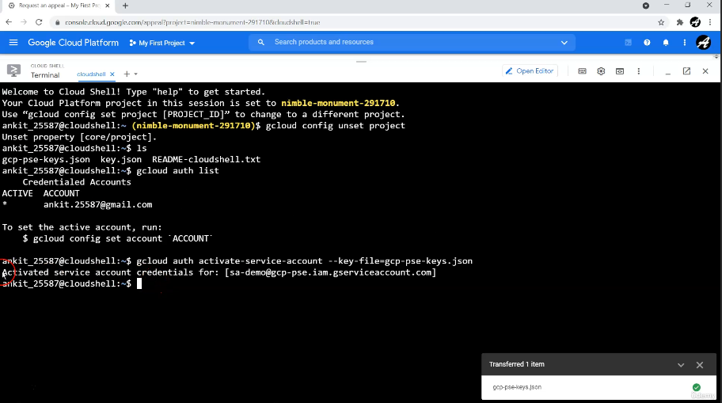
this command activates the service account

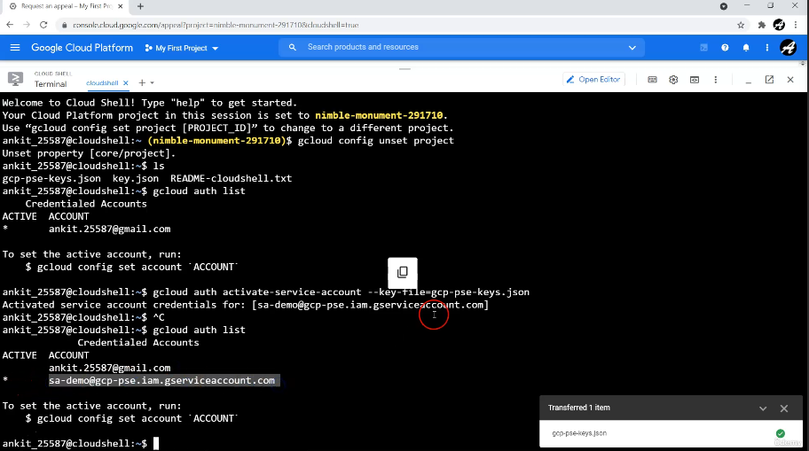
now the service account has been listed
since we have access to the service account via the keys

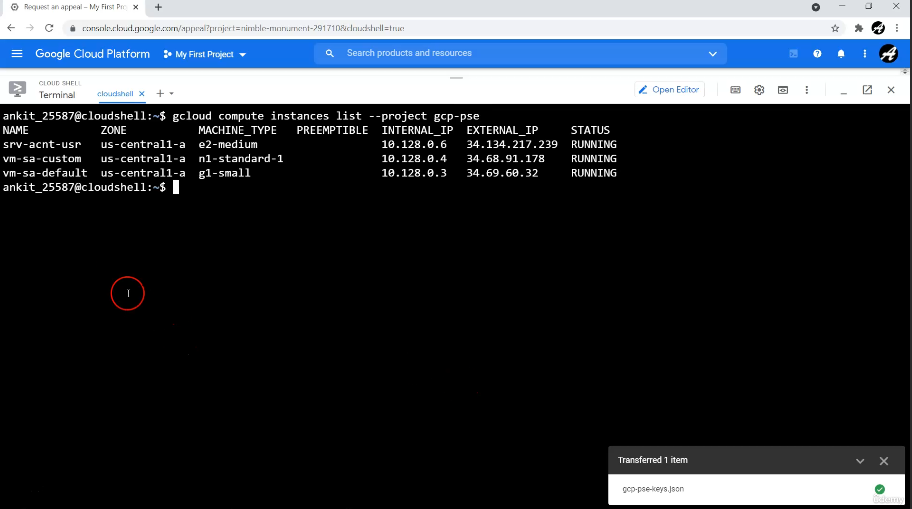
we are demonstrating that we have access to the permissions that the SA has
in this case we have permissions to interact with compute engine

the users/hacker will not get any blame because the service account is responsible for interacting with resources because impersonation

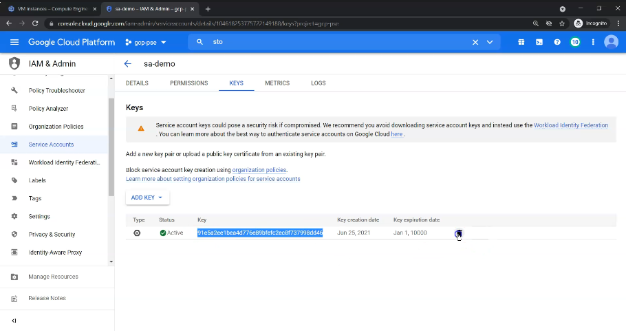
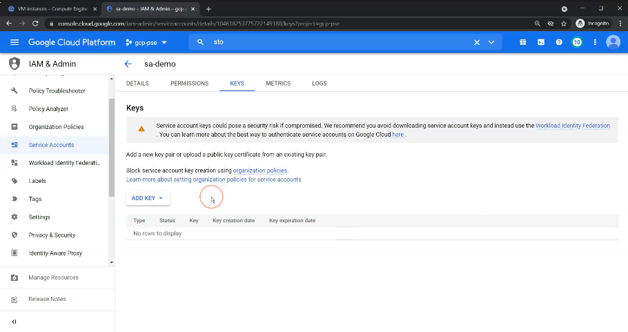
if the key gets compromised you can very easily delete it