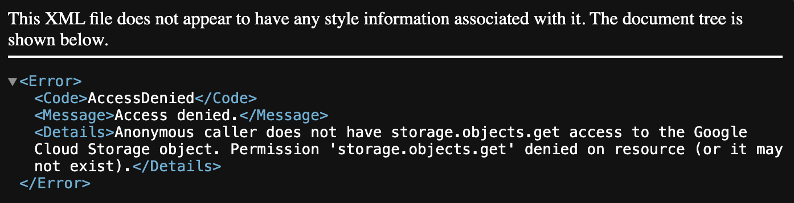
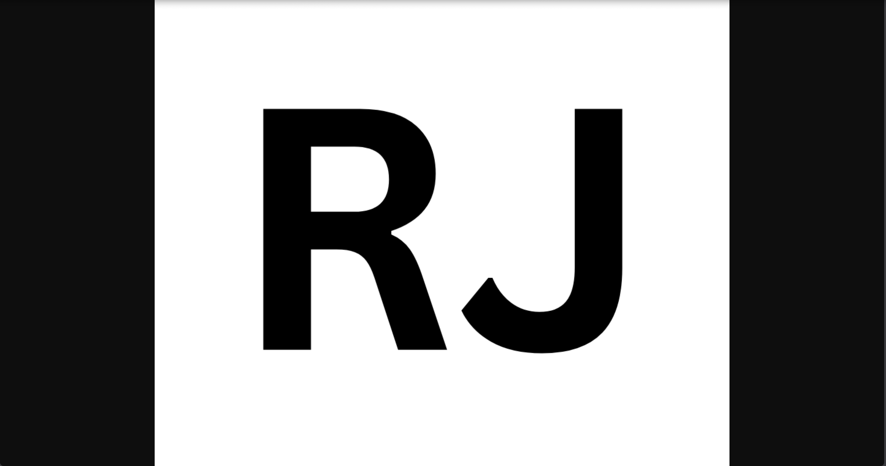

## Static Website Automated with GCS Project Documentation Framework

### 1. Project Overview
Deploy a proof of concept (POC) static website that is entirely automated with GCS (a GCP bucket) with some sample static assets

 * The URL of the website (leave it up, buckets are basically free)  
  * The repository with your code (your group leader can help check your code into Github if you can’t yet)  
  * Ideally you will have a readme explaining what this lab was, what it accomplishes, pros/cons, etc   
  * Ideally an output in the terraform of the fully formed (clickable) bucket URL is part of the terraform code but not required.   
* Additional requirements:  
  * Some short comments explaining things in your code that may not be obvious   
  * It cannot be generated by AI (Guys, It is so easy to tell)   
  * All documentation used to accomplish this lab.   
  * This should be the latest version of the provider and current code (such as what is in documentation).   
  * Copying and pasting documentation examples is totally fine. Just be sure you can explain what each part does. If you can’t remember, no problem\! Just add a comment to explain it.  
  * All comments must be written by you. A human. Not AI or a group leader.   
* [Go here for static assets to download and more instructions](https://github.com/aaron-dm-mcdonald/class7.5-notes/blob/main/week-7/bam/README.md)


---

### 2. Technical Architecture

* **Resource Inventory:** 
* **Decision Log:** 

---

### 3. Deployment Instructions

#### CLI INSTRUCTIONS

#### Phase 1: Building the Static Website
Use Google Gemini to create an static website. <br>
The static website is an landing page for an salsa event located in elsie rooftop in midtown manhattan. The event occurs every friday starting at 6pm. The cover charge is 25$. The website is a single page static website that has an call to action to book your tickets

Note : build this website in increments so you can catch errors early on

#### Phase 2: Create the Bucket, and Test Functionality

##### CREATING BUCKET
1. Navigate to Cloud Storage > Buckets > clicked create
2. Enter an name for the Google Storage bucket `static-website-01`
3. Location type selected Multi-Region
4. Storage class is standard
5. For prevent public access unchecked `Enforce public access prevention on this bucket` 
6. Clicked create

##### TESTING BUCKET FUNCTIONALITY
1. Uploaded image to bucket
2. Copied and pasted public URL of image uploaded to test if connectivity to bucket is successful

###### Result
THIS ERROR <br>
The following error was shown when attempting to access an image uploaded to said bucket


Solution <br>
Add an Role with the proper permissions to the bucket so the bucket can be accessed bia the public URL

What i learned <br>
allowing an bucket to accessed by users on the internet is not enough to grant access. the bucket needs the proper permissions to allow the users from the internet to interact with the bucket

##### ADDING PERMISSIONS TO ALLOW INTERNET ACCESS
1. Navigated to permissions > view by roles > click grant access
7. Add principal
8. New principal field enter allUsers
9. Select role > storage object viewer
10. Click save
11. Click allow public access

what i learned <br>
adding an new principal of all users makes the bucket accessible to anyone on the internet <br>
role of storage object viewer allows users to view objects within an bucket
click save <br>
you assign an role to to an bucket by going to permissions, assigning a role and a principal to it<br>

###### Result
You can view the Object within the bucket <br>
The following error was shown when attempting to access an image uploaded to said bucket


#### Phase 3: Add Website Files, and Test Functionality
1. Navigate to Cloud Storage > Buckets > locate bucket we created > click on 3 dots > edit website configuration
2. Enter an name for index page suffix
3. Enter an name for error page suffix
4. add an index.html file to the bucket
2. Copied and pasted public URL of html file uploaded to test if connectivity to bucket is successful

#### Phase 4: added load balancers

#### TERRAFORM INSTRUCTIONS
#### PHASE 1 : Setting up folders and infrastructure <br>
1. Create the following files, and set-up the following directory structure
- Authentication allows terraform to interact with Google Cloud Storage
- Backend allows terraform state file to be stored in Google Cloud
- Storage is the configuration where our static website is being deployed
```
TERRAFORM2/
├── .terraform/
├── .terraform.lock.hcl
├── 0-authentication.tf
├── 1-backend.tf
├── 2-storage.tf
├── 3-output.tf
```
#### PHASE 2 : Setting up 0-authentication.tf file
Using the method in video 25 for authentication for the Google provider.   

``` 
terraform {
  required_providers {
    google = {
      source  = "hashicorp/google"
      version = "~> 5.0" 
    }
  }
}

provider "google" {
  project = "class-seven-point"
  region  = "us-east4"
}
```

#### PHASE 3 : Setting up 1-backend.tf file
Configuring Terraform state so it gets uploaded into the Cloud
```
terraform {
  backend "gcs" {
    bucket = "class7point5-prod-tfstate-us-east1-9a2b"
    prefix = "terraform/state"
  }
}


resource "google_compute_disk" "grafana_disk" {
  name  = "grafana-disk"
  type  = "pd-standard"
  zone  = "us-east4-a"
  size  = 10
}
```
#### PHASE 4 : Setting up 2-storage.tf file
Setting up an static website

### Phase 5: Terraform output
create an Terraform output to output the bucket URL

#### TERRAFORM INSTRUCTIONS

Create an terraform folder with 3 files `0-authentication`, `1-storage`, `2-output` <br>
Your directory structure should look like this <br>
```
TERRAFORM/
├── .terraform/
├── .terraform.lock.hcl
├── 0-authentication.tf
├── 1-storage.tf
├── 2-output.tf
├── Website ├── 404.html
            ├── index.html
            ├── styles.css
            └── image.png
```

Creating 0-authentication.tf
1. Create an terraform block, and provider block to allow communication between Terraform, and our Google Cloud Account
2. Your configuration should look like this 

```
terraform {
  required_providers {
    google = {
      source  = "hashicorp/google"
      version = "~> 5.0" 
    }
  }
}

provider "google" {
  project = < PROJECT ID >
  region  = < REGION >
}
```

Creating 1-storage.tf
The 1-storage.tf terraform file is where all configuration for deploying the Google Cloud Storage Bucket is located. This configuration involves creating the bucket, uploading objects into the bucket, and adding permissions to allow internet users to access objects within the bucket

#### Phase 1: CREATE BUCKET

### A. CREATING BUCKET
Use the `google_storage_bucket` resource block to create an Google Cloud Storage Bucket to serve as the backend for the static website <br>
Apply some configuration to use specific files for the static website <br>

```
resource "google_storage_bucket" <name> {
  name          = <name>
  location      = <location>
  website {
    main_page_suffix = <html file>
    not_found_page =   <html file>
  }
}
```

after the website was created executed the following commands to verify we made the correct configuration and checked for errors
### Execute Terraform
## THIS IS DONE TO CHECK FOR ERRORS
#1. Terraform plan
#2. Terraform apply

#### Phase 2: UPLOAD OBJECTS
After `google_storage_bucket` resource block was used to create an Google Cloud Storage Bucket use `google_storage_bucket_object` to upload 3 Objects into the bucket. an HTML file, another HTML file, and an image

### B. UPLOADING OBJECTS INTO BUCKET
```
resource "google_storage_bucket_object" <name> {
 name         = <name>
 source       = <directory>
 bucket       = <bucket>
}
```

after the images were uploaded the following commands to verify we made the correct configuration and checked for errors
#### Execute Terraform
## THIS IS DONE TO CHECK FOR ERRORS
##1. Terraform plan
##2. Terraform apply

After `google_storage_bucket_object` resource block was used to upload 3 Objects into the bucket. an HTML file, another HTML file, and an image
```
resource "google_storage_bucket_object" <name> {
 name         = <name>
 source       = <directory>
 bucket       = <bucket>
}
```

executed the following commands to verify we made the correct configuration and checked for errors
### Execute Terraform
#### Execute Terraform
## THIS IS DONE TO CHECK FOR ERRORS
##1. Terraform plan
##2. Terraform apply


```
resource "google_storage_bucket_object" <name> {
 name         = <name>
 source       = <directory>
 bucket       = <bucket>
}
```

executed the following commands to verify we made the correct configuration and checked for errors
### Execute Terraform
#### Execute Terraform
## THIS IS DONE TO CHECK FOR ERRORS
##1. Terraform plan
##2. Terraform apply

#### Phase 3: ADDING PERMISSIONS TO ALLOW INTERNET ACCESS
used the following resource block `google_storage_bucket_iam_member` to upload objects to the Google Cloud Storage Bucket
```
resource "google_storage_bucket_iam_member" "public_viewer" {
  bucket = <bucket>          
  role   = <role> 
  member = <member>                  
}
```

executed the following commands to verify we made the correct configuration and checked for errors
### Execute Terraform
#### Execute Terraform
##1. Terraform plan
##2. Terraform apply

#### Result
## AN GOOGLE CLOUD STORAGE BUCKET THAT USERS CAN ACCESS OBJECTS DIRECTLY VIA PUBLIC URL


---

### 4. Verification & Quality Assurance (The "Proof")

* **Logs/Evidence:** 


---

### 5. Engineering Reflections

---
