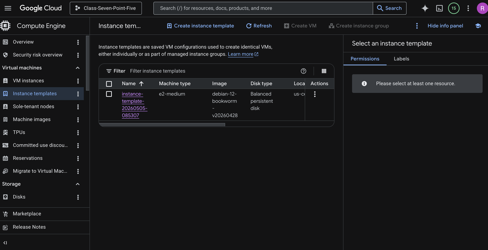
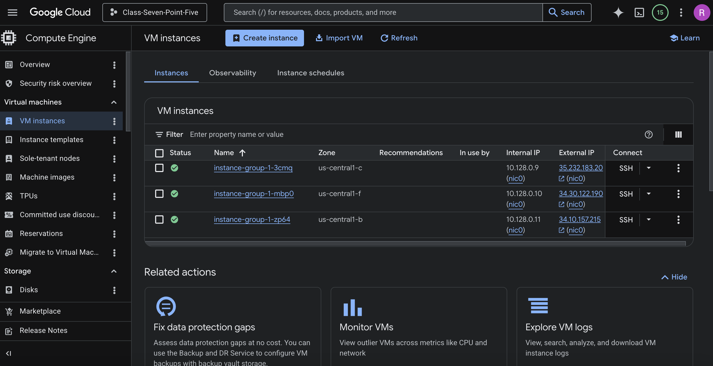
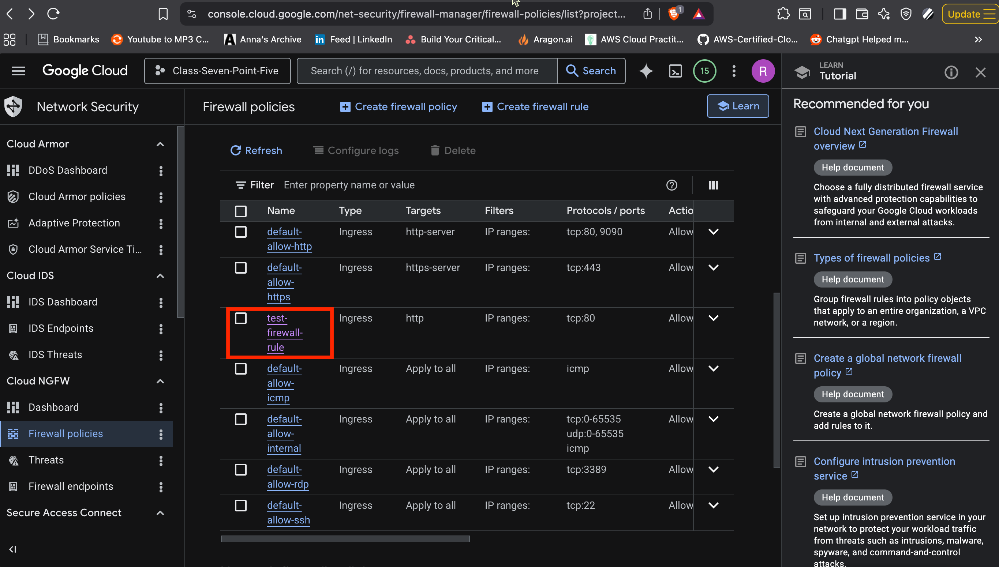
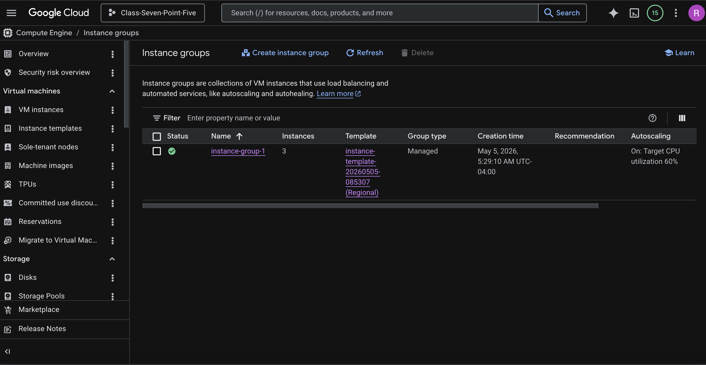
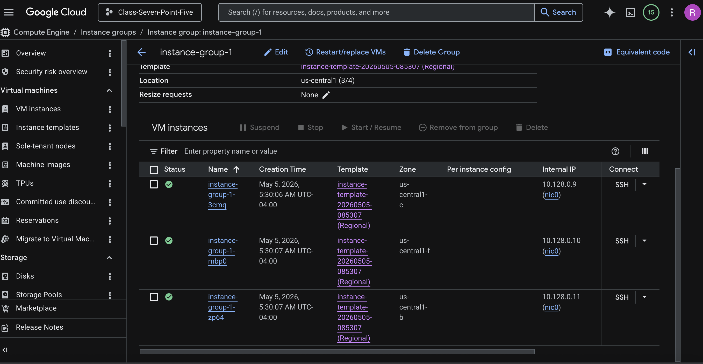

# Creating Managed Instance Groups Documentation

# RUNBOOK
## Overview
Managed Instance Groups illustrate operational excellence principals such as high availability and scalability within Google Cloud. Underlying components of instance groups allow an architect to achieve operational excellence within Google Cloud; instance templates, health checks, auto scaling, and auto healing influence high availability. In this runbook, step-by-step instructions are provided to configure an Managed Instance Group within Google Cloud.

## Navigation
- Step 1 Create the Instance Template
- Step 2 Create the Managed Instance Group 
- Step 3 Add a Firewall Rule
- Step 4 Test and Validate the Infrastructure

## Prerequisites

To complete this lab
- you need An web browser 
- An google cloud account

## Create the Instance Template
An Instance Template is an pre-made, re-useable, configuration created to provision an Compute engine instance. To restate, an instance template is made once; are reuseable which removing the need manually configure the instance. As an result, speed of provisioning virtual machines increases. The rapid provision leads an Instance Template to be used with Instance Groups; templates are the underlying component of Instance Groups to allow them to quickly deploy and destroy virtual machines

1. In the Google Cloud Console, navigate to **Compute Engine** > **Instance templates**.  
2. Click **Create instance template**.  
3. Configure the following settings  
   * Enter an value for **Name**  
   * **Location configuration:** Select **Regional** 
   * **Machine configuration:** Select **E2** series, and **e2-micro** **machine type** 
   * **Firewall configuration:** Select **Allow HTTP traffic**. 
   * **Advanced options** > Expand the **Networking** section.  
     * Enter an value for Network tag  
   * **Advanced options** > Expand the **Management** section.   
     * In the **Automation** input, and paste the following bash script into the value box:
```
#!/bin/bash

apt update -y
apt install -y nginx

cat <<EOF > /var/www/html/index.html
<html>
<head>
<title>SEIR-I Node</title>
<style>
body {
background-color:black;
color:#00ff00;
font-family:monospace;
padding:40px;
}
</style>
</head>

<body>

<pre>

Initializing Cloud Node...

Connecting to GCP Infrastructure...
Loading System Modules...

███████╗███████╗██╗██████╗
██╔════╝██╔════╝██║██╔══██╗
███████╗█████╗  ██║██████╔╝
╚════██║██╔══╝  ██║██╔══██╗
███████║███████╗██║██║  ██║
╚══════╝╚══════╝╚═╝╚═╝  ╚═╝

System Status: ONLINE

You deployed your first cloud server.

</pre>

</body>
</html>
EOF

systemctl restart nginx
```
4. Click **Create**.
5. End result


## Create the Managed Instance Group 
Managed Instance Groups represents an collection of Compute Engine Instances; each instance uses the same instance template for configuration. To clarify, the instance template used to eliminate manual configuration of multiple compute engine instances. In return, provisioning of virtual machines are uniform and rapid. Creating VM's is faster; increases elasticity and high availability. The following are core features, autoscaling, autohealing, and regional deployments. These features are critical to the configuration below

1. Navigate to **Compute Engine** > **Instance groups**.  
2. Click **Create instance group**.  
3. Configure the following settings  
   * Enter an value for **Name**   
   * **Instance Template configuration:** Select the template created in **Create the Instance Template** Step.  
   * **Location configuration:** Select **Multiple Zones**.  
   * **Region configuration:** Select same region configured for instance template.  
4. **Autoscaling configuration**:  
   * Click on **Configure Autoscaling**
   * **Minimum number of instances:** `3`  
   * **Maximum number of instances:** `6`   
5. **Autohealing configuration**:  
   * Click the **Health check** > select **Create a health check**.  
   * Enter an value for **Name**  
   * **Protocol:** `HTTP`  
   * **Port:** `80`  
   * **Interval** 10 seconds  
   * **Timeout** 3 seconds  
   * Leave all other defaults and click **Save and continue**.  
6. Click **Create**. 
7. End result


## Add a Firewall Rule
To allow the communication with vm and enter commands to test the infrastructure

1. Navigate to **VPC network** > **Firewall**.  
2. Click **Create firewall rule**.  
   * Enter an value for **Name**  
   * **Targets:** `Specified target tags`  
   * **Target tags:** The tag we added to our template in **Create the Instance Template** Step 
   * **Source filter:** `IPv4 ranges`  
   * **Source IP ranges:** `0.0.0.0/0`  
   * **Protocols and ports:** Check **Specified protocols and ports**, select **tcp**, and enter `80`.  
3. Click **Create**.
4. End result


## Test the Infrastructure
**Test A:** To test autoscaling, manipulate the virtual machine to create high CPU usage on the active VM. As an consequence, more virtual machines will be provisioned. after an specific time peroid compute engine instances will. be destroyed due to Cpu utilization being within normal limits

1. Navigate to **Compute Engine** > **VM instances**.  
2. Find the instance associated with MIG and click the **SSH**.  
3. Run the following commands to increase CPU utilization  
```
   sudo apt-get install stress
``` 
```
   sudo stress --cpu 2 --timeout 500
``` 
4. Allow 4 minutes to pass; the Managed Instance Group will detect the average CPU utilization exceeded the 60%. As an result, more instances will be provisioned  
5. Navigate to **Compute Engine** > **Instance groups** > `web-server-mig`.  
6. Refresh the page to view the **Instance count** chart or list. You will see an visual representation  
7. End the SSH session  
8. After several minutes of normal CPU utilization, the MIG will reduce number of instances back down to the minimum of `3`.

**Test B:** To verify that the instance group provisioned instances across multiple zones navigate to instance groups and view its properties. Note: technical overview use cloudshell



---

&nbsp;&nbsp;&nbsp;&nbsp;&nbsp;&nbsp;&nbsp;&nbsp;d. Explain how to enable autoscaling and autohealing <br>

---

## TERRAFORM
## Overview
The following Terraform configuration provisions an Google Cloud Engine instance within Google Cloud. Underlying components of the configuration is authentication, firewall, compute, variables, and output. In this section, multiple Terraform configuration files are provided to configure an Google Cloud Engine instance within Google Cloud.

## Prerequisites

To complete this lab
- An web browser 
- An google cloud account
- Terraform installed
- Authentication from terraform to google cloud

## Directory Structure
create your Terraform configuration files and a directory structure that resembles the following:
```
Terraform/
 ├── 0-authentication.tf
 ├── 1-firewall.tf
 ├── 2-compute.tf
 ├── 3-variables.tf
 ├── 4-outputs.tf
```

## 0-authentication.tf
```
terraform {
  required_providers {
    google = {
      source  = "hashicorp/google"
      version = "~>7.0.0"
    }
  }
}

provider "google" {
  project = var.project_id
  region  = var.region
}
```

## 1-firewall.tf
```
resource "google_compute_firewall" "allow-http" {
  name    = "allow-http"
  network = "default"

  allow {
    protocol = "tcp"
    ports    = ["80"]
  }

  source_ranges = ["0.0.0.0/0"]
  source_tags   = ["http-server"]

}
```

## 2-compute.tf
```

# resource "google_compute_address" "static-ip-address" {
#   name = "static-ip-address"
# }
resource "google_compute_instance" "dev-instance" {
  name = "dev-instance"
  
  # non-required attribute
  description  = ""
  zone         = var.zone
  machine_type = "n2d-standard-2"
  tags         = ["http-server"]
  boot_disk {
    initialize_params {
      image = "projects/centos-cloud/global/images/centos-stream-10-v20260505"
      size  = 100
    }
  }
  # non-required attribute
  attached_disk {
    source = google_compute_disk.additional-disk.self_link
  }

  network_interface {
    network = "default"
  }

  # network_interface {
  #   network = "default"
  #   subnetwork = data.google_compute_subnetwork.kubernetes.id
  #   access_config {
  #     nat_ip = google_compute_address.static-ip-address.address
  #   }
  # }

  metadata_startup_script = file("/Users/rahdejonesrahde/class-7.5/Class-7.5-SEIR-1/Homework/Week-8/Deliverables/Deliverable-1a/Startup-scripts/startup.sh")

}

resource "google_compute_disk" "additional-disk" {
  name  = "additional-disk"
  type  = "pd-ssd"
  zone  = "us-central1-a"
  image = "debian-11-bullseye-v20220719"
  labels = {
    environment = "dev"
  }
  physical_block_size_bytes = 4096
}
```

## 3-variables.tf
```
variable "project_id" {
  default     = "class-seven-point"
  description = "value"
}

variable "region" {
  default     = "us-central1"
  description = "value"
}

variable "zone" {
  default     = "us-central1-a"
  description = "value"
}
```

## 4-outputs.tf
```
output "instance_internal_ip" {
  value       = google_compute_instance.dev-instance.network_interface.0.network_ip
  description = "value"
}
# output "instance_external_IP" {
#  value = google_compute_instance.dev-instance.network_interface.0.network_ip
#  description = "value"
# }

output "instance_name" {
  value       = google_compute_instance.dev-instance.name
  description = "value"
}
output "instance_id" {
  value       = google_compute_instance.dev-instance.instance_id
  description = "value"
}

output "instance_self_link" {
  value       = google_compute_instance.dev-instance.self_link
  description = "value"
}
```

## Mandatory Arguments for a VM
The following arguments are mandatory to provision an virtual machine **boot_disk**, **machine_type**, **name**, **network interface**

- boot_disk is an virtual hard drive attached to an compute engine instance

- machine_type is an pre-set configuration for the compute engine instance

- name is is the name for compute engine instance

- network_interface allows an compute engine instance to connect to the VPC

## How to output the internal and external IP addresses of the provisioned VM  
1. Create an output block
2. Enter the value to appear in the terminal in the value attribute of the output block

## 2 non-required arguments used within VM configruation 
Two optional arguments used within the VM configuration are `attached disk` and `tags`. The argument attached_disk, attaches additional persistent disks to an Google Cloud Compute Engine Instance. The argument tags, attaches an tag to the instance.

## Difference between the “name” argument and the computed “id” and “self_link” attributes 
The following arguments `name`, `id`, and `self_link` are all ways to identify an resource within GCP. The difference between the 3 arguments are. First, name is an identifier for the resource in the form of an letters. Second, id is an identifier for the resource in the form of an series of numbers. Lastly, self_link is the URL of the resource. 


---

### Q & A
Each bullet point can be between 1-5 sentences. You choose the amount of detail as long as I see that you understand it. <br>
### What is the difference between high availability and fault tolerance? Which is best to strive for? 
High Availability is, when a system can continue function as some components fail. Fault tolerance is, when a system can continue function in an event that causes all components fail. The difference between High Availability and Fault tolerance is the resilience to failure. By design, Fault tolerance is more resilient to failure


### The difference between autoscaling and elasticity. ? 

The difference between auto scaling and elasticity is the following
1. Elasticity is an fundamental cloud concept. on the other hand, auto-scaling an action that occurs within cloud enviornments. MIG's adding and removing instances is an example of auto scaling; its an mechanism

What is vertical and horizontal autoscaling? Is one better? Are they feasible on prem
1. Vertical autoscaling is, increasing the computing power of an instance. For example, upgrading a single compute engine instance from small to xl
2. Horizontal autoscaling is, adding multiple copies of the same instance to handle an workload. for example, adding multiple compute engine instances to meet demand
3. Scaling both vertcal and horizontal is feasible on prem, but, the process is more time and resource intensive compared to scaling within the Cloud Computing enviornment


### Explain what the difference between managed and unmanaged instance groups is
The difference between an managed instance group and unmanaged instance groups is the configuration of the VM's in both instance groups. An managed instance group, contains VM's with identical configurations. An unmanaged instance group, contains VM's with different configurations.

### Explain in a few sentences what the 3 tier architecture is and how it relates to what you are learning. 
An 3 tired Architecture takes an monolithic application and divides it into 3 layers. Presentation, application, and database. This separation makes management of the application easier

---

### Citations
https://partner.skills.google/paths/18/course_templates/1169/labs/608711
https://github.com/aws-samples/achieving-operational-excellence-using-automated-playbook-and-runbook <br>
https://www.skills.google/focuses/1206?parent=catalog <br>
https://dev.to/latchudevops/part-37-google-compute-engine-managed-instance-groups-stateful-in-google-cloud-platform-gcp-2ib4 <br>
https://docs.cloud.google.com/compute/docs/instance-groups/distributing-instances-with-regional-instance-groups <br>
https://docs.cloud.google.com/compute/docs/instance-groups/distributing-instances-with-regional-instance-groups <br>
https://www.skills.google/focuses/42740?parent=catalog <br>
https://registry.terraform.io/providers/hashicorp/google/latest/docs/resources/compute_network <br>
https://registry.terraform.io/providers/hashicorp/google/latest/docs/resources/compute_subnetwork <br>
https://registry.terraform.io/providers/hashicorp/google/latest/docs/resources/compute_firewall <br>
https://serverfault.com/questions/1017276/use-metadata-startup-script-in-google-cloud-template-in-terraform <br>
https://stackoverflow.com/questions/61898892/terraform-gcp-create-instance-with-static-ip?rq=1 <br>
https://stackoverflow.com/questions/63401480/how-to-create-gcp-instance-with-public-ip-with-terraform <br>
https://stackoverflow.com/questions/70417826/terraform-and-gcp-create-new-compute-vm-in-existing-shared-vpc-and-subnet <br>
https://dev.to/onlyoneerin/understanding-high-availability-fault-tolerance-and-disaster-recovery-in-aws-an-overview-2o4p <br>
https://www.geeksforgeeks.org/system-design/scalability-vs-elasticity/